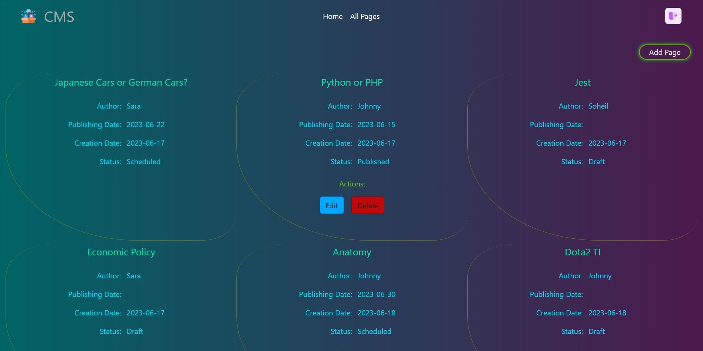
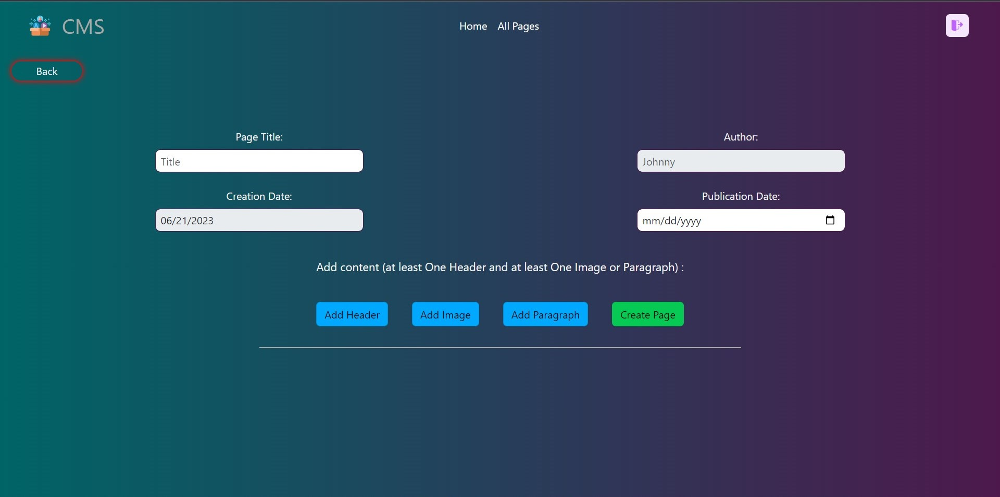

[](https://classroom.github.com/a/8AapHqUJ)

# Exam #1: "CMSmall"

## Student: s314287 Jamshidi Soheil 

## React Client Application Routes

- Route `/`: page content and purpose
- Route `/`: Home page of the website to show all the published contents to unauthorized users.
- Route `/login/`: Login page with email and password inputs to log in users.
- Route `/managepage/`: A page for Admins to manage all created pages include Edit and delete ant page. Also, Editing the name of the website in navbar.
- Route `/allpages/`: Page representing all created pages by all users. Also, give access to authorized users to look up pages created by him/her and have access to Edit or Delete his/her pages. In addition, move to Create Page through a button.
- Route `/createpage/`: Page of creating a new page that can be accessed through the All Pages.
- Route `/editpage/`: A page for editing the existing pages by users that has an extra feature for admins to change the author of a page too.
- Route `/:title/`: Page of representing the content of pages that include properties and contents of created pages.
- Route `*`: Displayed whenever an unscheduled route is searched, includes an Error message.


## API Server

- Get `/api/users`
  - request parameters and request body content: ```none```

  - response body content:
  [
    {
      "username": "Johnny",
      "email": "user1@gmail.com"
    },
    {
      "username": "Soheil",
      "email": "admin1@gmail.com"
    },
  ]

- Get `api/users/:email`
  - request parameters and body content:
    parameter:
    /api/users/admin1@gmail.com

    body content:
    {
      "email": "admin1@gmail.com",
      "password": 1234
    }

  - response body content:
  {
    "username": "Soheil",
    "email": "admin1@gmail.com",
    "role": "Admin"
  }

- Post `/api/newpage`
  - request parameters:
  {
    "title": "Dota2 or LoL?",
    "username": "Soheil",
    "creationdate": "2023-06-20",
    "publicationdatw": "2023-06-18",
    "status": "",
    "contents": [
      {
        "type": "header",
        "size": "2",
        "text": "Dota2"
      },
      {
        "type": "p",
        "text": "Anything is better than ..."
      }
    ]
  }

  - response body content:
  {
    "success"
  }

- Get `/api/pages`
  - request parameters and request body contetn: ```none```

  - response body content:
  [
    {
      "pageid": 9,
      "title": "Python or PHP",
      "author": "Johnny",
      "creationdate": "2023-06-17",
      "status": "Published",
      "publicationdate": "2023-06-15",
      "content": "[{\"type\":\"header\",\"size\":\"1\",\"text\":\"Python\"},{\"type\":\"p\",\"text\":\"Python is a popular high-level programming language that was first released in 1991. It was created by Guido van Rossum and is known for its simplicity, readability, and versatility. Python has gained widespread adoption in various domains, including web development, data analysis, scientific computing, artificial intelligence, and automation.\"},{\"type\":\"header\",\"size\":\"1\",\"text\":\"PHP\"},{\"type\":\"p\",\"text\":\"PHP (Hypertext Preprocessor) is a server-side scripting language that is widely used for web development. It was created by Rasmus Lerdorf in 1994 and has since evolved into a popular choice for building dynamic websites and web applications.\"}]"
   },
   {
      "pageid": 10,
      "title": "Jest",
      "author": "Soheil",
      "creationdate": "2023-06-17",
      "status": "Draft",
      "publicationdate": " ",
      "content": "[{\"type\":\"header\",\"size\":\"2\",\"text\":\"What is Jest?\"},{\"type\":\"p\",\"text\":\"Jest is a popular JavaScript testing framework developed by Facebook. It is primarily used for testing JavaScript code, including applications, libraries, and components. Jest provides a comprehensive and efficient testing environment, making it easier to write, run, and manage tests.\"}]"
    },
  ]

- Get `/api/pages/published`
  - request parameters and request body contetn: ```none```

  - response body content:
  [
    {
      "pageid": 17,
      "title": "Acquaintance with Architecture",
      "author": "Soheil",
      "creationdate": "2023-06-20",
      "status": "Published",
      "publicationdate": "2023-06-20",
      "content": "[{\"type\":\"img\",\"name\":\"picture2.png\"},{\"type\":\"header\",\"size\":\"1\",\"text\":\"Architecture \"},{\"type\":\"p\",\"text\":\"Architecture refers to the art and science of designing and constructing buildings and other physical structures. It encompasses the planning, designing, and construction of spaces that are functional, aesthetically pleasing, and responsive to human needs.\"}]"
    }
  ]

- Get `/api/pages/:username`
  - request parameters:
    "Soheil"

  - response body content:
  [
    {
      "pageid": 10,
      "title": "Jest",
      "author": "Soheil",
      "creationdate": "2023-06-17",
      "status": "Draft",
      "publicationdate": " ",
      "content": "[{\"type\":\"header\",\"size\":\"2\",\"text\":\"What is Jest?\"},{\"type\":\"p\",\"text\":\"Jest is a popular JavaScript testing framework developed by Facebook. It is primarily used for testing JavaScript code, including applications, libraries, and components. Jest provides a comprehensive and efficient testing environment, making it easier to write, run, and manage tests.\"}]"
    }
  ]

- Delete `/api/deletepage`
  - request body content:
  {
    "pageid": 13
  }
  
  - response body content:
    "success"

- Post `/api/updatepage`
  - request body content:
  {
    "pageid": 19,
    "title": "Dota2 or LoL?",
    "author": "Soheil",
    "publicationdatw": "2023-06-18",
    "status": "",
    "contents": [
      {
        "type": "header",
        "size": "2",
        "text": "Dota2"
      },
      {
        "type": "p",
        "text": "Anything is better than ..."
      }
    ]
  }

  - response body content:
    "success"

- Get `/api/pictures`
  - request body content: ```none```

  - response body content:
  [
    {
      "imageid": 1,
      "name": "picture1.png"
    },
    {
      "imageid": 2,
      "name": "picture2.png"
    }
  ]

- Get `/api/lastid`
  - request body content: ```none```

  - response body content:
    19

- Get `/api/webname`
  - request body content: ```none```

  - response body content:
    "CMSmall"

- Post `//api/upwebname`
  - request body content:
    {
      "webname": "CMSmall"
    }

  - response body content:
    "success"

- Post `/api/sessions`
  - request parameters: credential for passport authentication
  - request body: credential
  - response body: user info

- Get `/api/sessions/current`
  - request parameters: credential for passport authentication
  - response body: user info

- Delete `/api/sessions/current`
  - request parameters: credential for passport authentication
  - response body: none


## Database Tables

- Table `users` - contains Username, Email, HASHEDPassword, Salt, Role
- Table `pages` - contains Pageid, Title, Author, Creationdate, Status, Publicationdate, Content
- Table `images` - contains Imageid, Name
- Table `info` - Keeping the website name


## Main React Components

- `Allpages` (in `allpages.jsx`): Illustrating all pages created by all users to authenticated user.
- `Content` (in `content.jsx`): Shows contents and properties of a page.
- `Headerblock` (in `createcomponents.jsx`): A block for creating a header component while creating a page or editing it.
- `Paragraphblock` (in `createcomponents.jsx`): A block for creating a paragraph component while creating a page or editing it.
- `Imageblock` (in `createcomponents.jsx`): A block for adding an image component while creating a page or editing it.
- `Createpage` (in `createpage.jsx`): A component for creating a new page.
- `Editpage` (in `editpage.jsx`): Edit component for editing an existing page.
- `Loginform` (in `login.jsx`): A login page for users to login in the website.
- `Main_content` (in `main.jsx`): The main page of the website to show all the published pages to authenticated and unauthenticated users.
- `Managepage` (in `managepage`): To represent all the pages created to admins and gives access to admins for editin or deleting pages. Also, Editing the website's name.
- `Navbar_Temp` (in `navbar.jsx`): The navbar of the page to improve the accessibility of pages.
- `App` (in `App.jsx`): The main component to show all pages and establish the routing.


## Screenshot

`All Pages` Screenshot:


`Create Page` Screenshot:


## Users Credentials

- username: admin1@gmail.com, password: 1234 
- username: user1@gmail.com, password: 1234 
- username: user2@gmail.com, password: 1234 
- username: user3@gmail.com, password: 1234 
